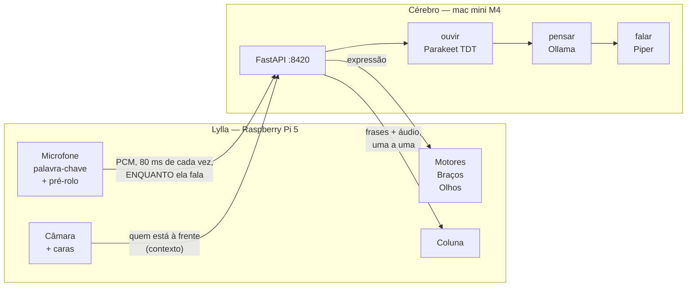

# Configuração de Inteligência Artificial

> **Estado:** a API está montada e a correr, com o áudio a ir para o mini
> **em contínuo** enquanto a Lara fala. Os modelos são agora uma escolha
> fundamentada mas **por medir na máquina** — `python -m cerebro.medir`.
> Ver [Modelos](#modelos) e [As perguntas de agosto](#as-perguntas-de-agosto).

## O que ficou decidido

1. **Os modelos todos correm no mac mini.** O Pi não pensa: ouve, vê e mexe-se.
2. **Nada de contentores.** Venv com o `uv`, e um serviço do launchd. Porquê: [abaixo](#porque-é-que-não-há-docker).
3. **Uma API só, um endereço só.** O robô sabe `http://mini:8420` e mais nada.
4. **As respostas trazem ações.** Um pedido devolve a cara, a fala *e* o que fazer.
5. **Nada disto sai de casa.** Sem APIs de terceiros, como no resto do projeto.
6. **O áudio vai em contínuo.** O mini transcreve enquanto ela fala, em vez de
   esperar que ela acabe. Ver [Escutar em contínuo](#escutar-em-contínuo).

## Arquitetura



Uma ligação por turno, e as duas pontas a trabalhar ao mesmo tempo:

```
     a Lara fala  ████████████████████
   o mini ouve      ░░░░░░░░░░░░░░░░░░░▒        ← acompanha, não espera
   o mini pensa                        ████████
    o robô fala                          ██████████████
                                       ↑
                          é ESTE o intervalo que ela sente
```

Antes, transcrever só **começava** quando ela se calava, e esse tempo todo
ficava à frente da resposta. Tudo em Tailscale, cifrado ponta a ponta.

### O que fica no Pi, e porquê

| Fica no Pi | Porquê |
|---|---|
| Palavra-chave (`openWakeWord`) | Corre sempre, tem de ser instantânea e não pode depender da rede |
| **Decidir que a frase acabou** | É uma decisão que não pode depender da rede — e é aqui que está o microfone |
| **O pré-rolo** | 1,6 s em buffer circular: o princípio da frase não se perde no tempo que leva a abrir a gravação |
| «Pára», «não olhes para mim» | Segurança e privacidade **nunca** dependem de um modelo — nem da rede |
| Cache de voz em disco | É o que o faz continuar a falar com o mini desligado |
| Sensores, motores, braços, olhos | É o corpo |

E o que **não** fica no Pi, de propósito: não há Whisper nem Ollama nenhum lá
dentro. Com o mini desligado o robô não percebe o que lhe dizem — e diz isso,
com a voz que tem em cache. Um Whisper que perceba português no Pi 5 fica mais
lento que o tempo real, e são 500 MB no cartão SD para um caso que o Tailscale
torna raro.

## Limitações

1. Não usar modelos ou APIs de terceiros.
2. Não usar modelos que excedam os recursos disponíveis.
3. **Latência acima de rigor.** É um brinquedo: uma resposta errada mas viva
   vale mais que uma certa e lenta.

## Hardware

- Apple M4 · **16 GB RAM** · 256 GB SSD interno · 2 TB SSD externo (sempre ligado)
- WiFi (pode ser uma das nossas limitações)
- Parte de uma rede tailscale junto com a Lylla.

⚠️ **16 GB é o número que manda.** Um LLM de 12B em 4 bits ocupa ~7–8 GB, e o
Whisper e o macOS querem o resto. Os modelos ficam *residentes* (`keep_alive: -1`)
— sem isso, a primeira frase depois de uns minutos de silêncio paga o
carregamento todo. Ou seja: **um LLM, um Whisper, e mais nada.**

## As perguntas de agosto

Cinco decisões que foram postas em causa, e o que as mediu ou as mudou.

### Go em vez de Python?

**Não, e o número diz porquê.** Medido no turno completo, com os motores de
mentira para isolar só a camada de código:

| | tempo |
|---|---|
| Pedido HTTP mais simples que existe (`/v1/saude`) | **1,5 ms** |
| Turno completo (receber, JSON, base64, eventos) | **4,7 ms** |
| Receber e descodificar 94 KB de WAV | **0,5 ms** |
| `base64` de 96 KB de áudio | **0,10 ms** |
| O `ExtratorDeFala` a ler uma resposta inteira | **0,03 ms** |

Um turno real demora **1 a 2 segundos**, e ~99,5% disso são o modelo a
trabalhar. Reescrever isto em Go poupava talvez 3 ms num turno de 1500 — e o
utilizador é uma criança de 10 anos à espera que o robô responda.

O que se perdia é que era o problema:

- **O MLX, o `parakeet-mlx` e o `piper` são Python.** Em Go, ou se chamava um
  subprocesso Python (pior que o que temos), ou FFI para uma runtime Python
  embebida. O ganho evapora-se e a complexidade triplica.
- **O contrato deixava de ser um ficheiro só.** O `robot/brain/acoes.py` é
  importado pelas *duas* máquinas — é isso que garante que o mini nunca
  oferece uma ação que o Pi não sabe fazer. Em Go seria uma cópia em Go e uma
  em Python, a divergir em silêncio. É exatamente o bug que este desenho
  existe para tornar impossível.
- **A Lara não leria o código.** Metade deste projeto é ela poder abrir um
  ficheiro e mudar uma coisa.

Onde Go (ou Rust) ganhariam mesmo é onde há um ciclo apertado por amostra de
áudio — e essa parte não é nossa: está dentro do MLX, em Metal.

### Modelos de STT — o Whisper saiu

Pesquisado no Hugging Face em agosto de 2026, e há um facto que decide sozinho:

> **O `parakeet-tdt-0.6b-v3` da NVIDIA é o único modelo aberto cujo cartão diz
> que foi treinado com português EUROPEU.**
>
> *"Performance differences may be partly attributed to Portuguese variant
> differences — our training data uses European Portuguese while most
> benchmarks use Brazilian Portuguese."*

Todos os outros dizem só `pt`. E já sabemos, pelo ouvido, que essa diferença é
real — foi ela que matou a `tugão`, o XTTS e o Kokoro do lado das vozes. Do
lado de ouvir tem número: o benchmark **CAMÕES** (arXiv 2508.19721) mede o
Whisper-large-v3 a **19,2% de WER** em português europeu, e mostra que afinar
num dos portugueses estraga o outro (12,5% em PE → 27,2% em PB).

| Modelo | Tamanho | pt-PT? | MLX | Streaming | Popularidade |
|---|---|---|---|---|---|
| **`parakeet-tdt-0.6b-v3`** | 2,5 GB F32 · 908 MB int8 | **declarado** | **sim** | **sim (TDT)** | 719k/mês · 1,07k ♥ |
| `whisper-large-v3-turbo` | 1,6 GB | só `pt` · 19,2% WER | sim | não (janela 30 s) | 8,7M/mês · 3,2k ♥ |
| `Voxtral-Mini-4B-Realtime` | 3,1 GB a 4 bits | só `pt` | sim | **nativo, <500 ms** | 2,4M/mês · 952 ♥ |
| `Qwen3-ASR-0.6B` | 708 MB a 4 bits | só `pt` | sim | só via vLLM | 3,4M/mês |
| `canary-1b-v2` | 978 MB | **declarado** | não (exige NeMo) | não | 12,8k/mês |
| `kyutai/stt-1b` | 1 GB | **não — en/fr** | sim | nativo | — |
| `moonshine-streaming` | 34 MB | **não — en** | — | nativo | — |

O Voxtral é tecnicamente o melhor streaming que existe, mas 3,1 GB não cabem
ao lado de um LLM de 8 GB em 16 GB de RAM. O Parakeet ganha em tudo o que
importa aqui, e ainda **deteta a língua sozinho** — que é exatamente o que o
modo inglês precisa (ela fala português, ele responde em inglês).

Ficou como `ouvir.motor: "parakeet"`. O Whisper fica como alternativa no
`medir.py`, para se confirmar a diferença com voz a sério em vez de se
acreditar num cartão.

⚠️ **Por confirmar:** não há WER publicado em pt-PT para o Parakeet — os
números do cartão (FLEURS 4,76%) são medidos em pt-**BR**. A afirmação de
treino em PE vem do cartão, não de uma avaliação independente. É por isso que
a decisão a sério é a de sempre: gravar uma frase da Lara e ouvir.

### Porquê o Ollama e não o MLX?

Esta é a boa pergunta, e a resposta surpreendeu-me: **o Ollama já É MLX — mas
não nesta máquina, e ainda bem.** Quatro factos, todos verificados na fonte:

**1. O `mlx-lm` oficial não força JSON Schema, e nunca vai forçar.** Não é uma
funcionalidade em falta — é uma **recusa explícita**. O PR
[#845](https://github.com/ml-explore/mlx-lm/pull/845) fazia exatamente isso e
foi fechado sem merge em fevereiro de 2026: *«I don't think it makes sense to
take outlines as a dependency here.»* Mandar `response_format` ao
`mlx_lm.server` hoje devolve **resposta vazia, sem erro nenhum**
([#1007](https://github.com/ml-explore/mlx-lm/issues/1007)).

E isto não é um detalhe: **é a gramática que faz esta arquitetura funcionar.**
Não pedimos ao modelo que responda em JSON — obrigamo-lo, token a token. Sem
isso, voltamos a apanhar markdown e chaves inventadas.

**2. Com 16 GB, o Ollama nem usa MLX.** O motor MLX do Ollama exige **mais de
32 GB** de memória unificada ([blog oficial](https://ollama.com/blog/mlx)).
O mini está no caminho llama.cpp/Metal — que é precisamente onde o `format`
funciona.

**3. E o motor MLX do Ollama ignora o `format` em silêncio.** Três issues
abertas com o mesmo padrão
([#16563](https://github.com/ollama/ollama/issues/16563),
[#16776](https://github.com/ollama/ollama/issues/16776),
[#17013](https://github.com/ollama/ollama/issues/17013)):
`gemma4:31b` cumpre o schema, `gemma4:31b-mlx` devolve texto corrido. Dentro
do Ollama, **MLX e JSON forçado são hoje mutuamente exclusivos.**

**4. A gestão de memória é o risco maior, não a velocidade.** O `mlx_lm.server`
não tem equivalente a `keep_alive`
([#1235](https://github.com/ml-explore/mlx-lm/issues/1235): *Ollama ~380 MB em
repouso; MLX 14,5 GB residentes para sempre*), não tem `--max-kv-size`, e tem
um **kernel panic documentado** por crescimento ilimitado do KV cache
([#883](https://github.com/ml-explore/mlx-lm/issues/883)) — numa máquina de
96 GB. Com 16 GB partilhados com o Parakeet, chega-se lá mais cedo. E o
`mlx_lm.server` **crasha com o Gemma 4** por causa da sliding-window attention
([#1256](https://github.com/ml-explore/mlx-lm/issues/1256)).

**E o prémio?** ~15% mais tokens/s — mas o **prefill é mais lento** (M4 Max,
8B Q4: llama.cpp 1420 tok/s vs MLX 1180). O prefill é o tempo até ao primeiro
token, que é a única métrica que a Lara sente. Trocávamos a métrica que conta
pela que não conta.

**Mas o teu instinto está certo, e está aplicado onde funciona:** o **Parakeet
corre em MLX**. É lá que o Apple Silicon rende — no áudio, onde não há
gramática nenhuma a forçar e onde o ganho é de uma ordem de grandeza, não de
15%. O mini usa MLX para ouvir e llama.cpp para pensar, e cada um está onde é
melhor.

Se quiseres experimentar à mesma, o caminho de menor risco é o **LM Studio em
modo headless** (`lms server start`): usa MLX **com** Outlines por baixo, tem
`response_format: json_schema` a sério, e o motor `openai` do `medir.py` fala
com ele sem se mexer numa linha:

```bash
python -m cerebro.medir --motor-pensar openai --pensar <modelo>
```

⚠️ Se um dia mudares de motor, **valida sempre o JSON do lado do cliente** — as
PRs abertas no Outlines em agosto/2026 são todas sobre *silent failures* na
geração MLX, e o modo de falha é o pior possível: a restrição desaparece sem
ninguém dar por isso. (O `acoes.normalizar()` já faz essa validação; é para
isto que ela existe.)

### Modelos de pensamento

Concordado: fica o `gemma4`. O `medir.py` está lá para quando quiseres
comparar, e o `4b` continua a valer a pena medir — metade da latência, e com
saída estruturada a exigência sobre o modelo é bem menor do que era com *tool
calling*.

### Escolher com medidas

É o que o `cerebro/medir.py` faz, e agora também mede o ganho do streaming:
quanto tempo o modelo gasta a transcrever **durante** a fala, e quanto **sobra**
depois de ela se calar. Ver [Modelos](#modelos).

## Escutar em contínuo

**A pergunta era: dá para mandar o áudio à medida, em vez de esperar pelo fim?**
Dá, e é o maior ganho de latência que este desenho tinha por explorar.

O que mudou:

```
ANTES  ·  /v1/turno
  [ela fala 2,4 s] → [envia 94 KB] → [transcreve 400 ms] → [pensa] → [fala]
                                     └── tudo isto à frente da resposta ──┘

AGORA  ·  /v1/escutar
  [ela fala 2,4 s]                                        → [pensa] → [fala]
   └ o áudio vai a caminho, 80 ms de cada vez ┘
   └ o mini vai transcrevendo ────────────────┘
                                              ↑ quando ela se cala, falta ~nada
```

Três coisas que fazem isto funcionar:

**1. O pré-rolo.** Entre ouvir «Olá robô» e abrir a gravação passa-se tempo, e
as crianças não esperam — a Lara diz «Olá robô SEGUE-ME» de enfiada. A
palavra-chave já lê blocos de 80 ms, por isso guarda os últimos **1,6 s** numa
fila circular (50 KB, não custa nada). Quando a palavra dispara, esse buffer é
a **primeira** coisa que vai para o mini, que começa a transcrever antes de o
microfone sequer reabrir.

> ⚠️ E o pré-rolo teve um efeito colateral que quase estragou tudo: como ele
> contém sempre a palavra mágica, o que chega ao Pi já não é «pára» mas «olá
> robô pára» — e o `comandos_diretos.py` comparava por igualdade exata. **O
> travão de emergência e o interruptor da câmara deixaram de funcionar.** As
> duas coisas que aquele ficheiro existe para garantir que nunca dependem do
> modelo passaram a depender dele. Corrigido: corta-se o que vier antes da
> palavra-chave e só depois se compara. Deliberadamente mais estrito do que
> «acaba em pára» — uma frase que por acaso termine nessa palavra não pode
> travar o robô a meio de uma brincadeira.

**2. Quem decide que a frase acabou continua a ser o Pi.** Não podia ser de
outra maneira: é uma decisão que não pode depender da rede, e é o Pi que tem o
microfone. O mini só transcreve o que lhe chega.

**3. O descodificador TDT do Parakeet só avança.** É o que separa isto de
"streamar" o Whisper à força: o Whisper trabalha em janelas de 30 s e tem de
reprocessar o que já ouviu (é o que o WhisperLiveKit e o SimulStreaming fazem,
com LocalAgreement/AlignAtt). O Parakeet é incremental por construção.

### O protocolo

```
WS /v1/escutar
  → {"contexto": {...}, "sessao": "lylla"}      abertura, uma vez
  ← {"tipo": "pronto", "incremental": true}
  → <bytes>  PCM int16 mono 16 kHz, 80 ms de cada vez
  ← {"tipo": "parcial", "texto": "olá lylla se"}     ← enquanto ela fala
  → {"fim": true}                               o Pi detetou o silêncio
  ← {"tipo": "ouvido", ...} e o resto igual ao /v1/turno
```

`{"cancelar": true}` interrompe o turno a meio — é assim que um «pára» não
fica à espera de uma resposta que já não interessa.

**Um motor que não saiba transcrever à medida continua a servir**: o
`SessaoAcumulada` junta tudo e transcreve no fim. O robô só perde a vantagem,
não a capacidade. E o `/v1/turno` fica a funcionar — `cerebro.escutar_em_directo:
false` no `robot.yaml` volta ao caminho antigo, se o streaming der problemas
em casa.

### Ver o ganho sem microfone

```bash
python scripts/test_cerebro.py --escutar frase.wav
```

Manda o WAV como se estivesse a ser dito agora, em bocados de 80 ms:

```
   [    8 ms] 🎧 escuta aberta (transcreve à medida)
   [   93 ms] … «olá»
   [  179 ms] … «olá robô»
   [ 2568 ms] 👤 «olá robô»
   [ 2630 ms] 🤖 «Hello! I am so happy to see you.»

   ⏱️  a Lara falou 2.4 s
       da última palavra dela à primeira dele: 39 ms
       2 transcrições parciais durante a fala — trabalho que não ficou para o fim
```

Cada parcial é trabalho que já não fica para o fim.

### Quanto é que isto poupa, medido

Os dois caminhos com o mesmo LLM e o mesmo TTS, cronometrados a partir da
**última palavra da criança** — que é o instante que ela sente. Frase de 1,6 s,
STT a RTF 0,13 (a ordem de grandeza do Parakeet em MLX):

| | `/v1/escutar` | `/v1/turno` | |
|---|---|---|---|
| a cara muda | **349 ms** | 513 ms | −164 ms |
| a 1ª frase toca | **1152 ms** | 1293 ms | −142 ms |
| o turno acaba | **2581 ms** | 2779 ms | −198 ms |

O ganho é exatamente o tempo de transcrever, que deixou de estar à frente da
resposta — e cresce com o tamanho da frase. Numa frase de 3 s são ~300 ms.

⚠️ **Este ganho é frágil, e já se perdeu uma vez.** A primeira versão deste
endpoint juntava os eventos todos numa lista antes de os enviar
(`list(gerador)`), o que corria o LLM **e** o TTS de todas as frases antes de
o primeiro evento sair. Resultado medido: a primeira frase chegava **2,4×**
mais tarde do que pelo caminho antigo. O endpoint feito para ser mais rápido
era mais lento — e a única forma de dar por isso foi cronometrar os dois lado
a lado. O `tests/test_escutar_arestas.py` tem agora um teste que falha se
isso voltar a acontecer.

## Porque é que não há Docker

Foi a pergunta certa a fazer, e a resposta é: **no macOS um contentor corre
dentro de uma VM Linux, e uma VM não tem acesso ao Metal.** Perdia-se o MLX,
o Neural Engine e a memória unificada — que é exatamente aquilo por que
escolhemos o mini. O Ollama pela mesma razão corre nativo (a imagem de Docker
dele é só CPU no Mac).

O que o Docker dava era um ambiente reproduzível. Isso conseguimos de outra
maneira:

| Queríamos | Como se resolve |
|---|---|
| Ambiente igual em todo o lado | `.venv-cerebro` + `requirements-cerebro.txt` com versões fixas, criado pelo `uv` |
| Instalação de um comando | `./cerebro/instalar.sh` |
| Arranca sozinho, reinicia se morrer | `launchd` (`--servico`), com `KeepAlive` |
| Publicar uma versão nova | `./scripts/deploy_mini.sh` (git pull + reiniciar + verificar) |
| Correr sem os modelos instalados | os motores `teste` |

**Se um dia isto tiver de correr noutra máquina que não um Mac** (um Linux com
GPU, por exemplo), aí um contentor faz todo o sentido — e o código não muda,
porque os motores já estão separados por trás de uma interface.

## A API

`http://mini:8420` — documentação interativa em `/docs`.

| Método | Caminho | O que faz |
|---|---|---|
| `GET` | `/v1/saude` | Está de pé? Que motores e que modelos |
| `GET` | `/v1/capacidades` | O contrato: ações, caras e o esquema JSON |
| `POST` | `/v1/ouvir` | WAV → `{"texto": …}` |
| `POST` | `/v1/pensar` | texto → `{"expressao", "fala", "acoes"}` |
| `POST` | `/v1/falar` | texto → WAV |
| `POST` | `/v1/turno` | WAV ou texto → fluxo de eventos |
| `WS` | `/v1/escutar` | **O mesmo, com o áudio a chegar em contínuo.** É o que o robô usa |
| `POST` | `/v1/esquecer` | Limpa o histórico da conversa |

Cada peça tem o seu endpoint para se poder testar sozinha com um `curl` — é a
regra da casa nº 1 aplicada à IA.

```bash
curl http://mini:8420/v1/saude
curl -X POST http://mini:8420/v1/ouvir --data-binary @frase.wav -H 'Content-Type: audio/wav'
curl -X POST http://mini:8420/v1/pensar -H 'Content-Type: application/json' \
     -d '{"texto":"segue-me!","contexto":{"pessoa":"Lara","bateria_pct":80}}'
curl -X POST http://mini:8420/v1/falar -H 'Content-Type: application/json' \
     -d '{"texto":"Olá, Lara!"}' -o ola.wav
```

### O turno

```bash
curl -N -X POST http://mini:8420/v1/turno \
     -F audio=@frase.wav -F 'contexto={"pessoa":"Lara"}'
```

Devolve NDJSON — uma linha por evento, à medida que acontecem:

```jsonc
{"tipo":"ouvido",   "texto":"Lylla, segue-me!", "duracao_s":1.8, "tempo_ms":240}
{"tipo":"expressao","nome":"feliz"}                        // ← muda a cara JÁ
{"tipo":"frase",    "texto":"Claro!", "audio_b64":"UklGR…"} // ← já dá para tocar
{"tipo":"frase",    "texto":"Vou atrás de ti.", "audio_b64":"UklGR…"}
{"tipo":"resposta", "expressao":"feliz", "fala":"Claro! Vou atrás de ti.",
                    "acoes":[{"nome":"seguir","argumentos":{"acao":"comecar"}}]}
{"tipo":"fim",      "tempo_ms":{"ouvir":240,"primeira_frase":900,"total":2100}}
```

### A resposta é uma forma, não um texto

O modelo é **obrigado** a responder com este objeto — não é um pedido no
prompt, é uma gramática (`format` do Ollama) construída a partir do catálogo
em [`robot/brain/acoes.py`](../robot/brain/acoes.py):

```json
{
  "expressao": "feliz",
  "fala": "Claro! Vou atrás de ti.",
  "acoes": [{"nome": "seguir", "argumentos": {"acao": "comecar"}}]
}
```

Três coisas que valem a pena explicar:

**A ordem das chaves é deliberada.** O modelo gera por ordem; o mini lê o JSON
à medida que ele sai. `expressao` primeiro significa que os olhos mudam antes
da primeira palavra. `fala` a seguir significa que a primeira frase toca
enquanto a segunda ainda está a ser escrita.

**Substituiu o *tool calling*.** Com ferramentas, os modelos pequenos ou falam
ou agem: quando chamam uma função, o texto vem vazio (é a armadilha nº 3 do
`PLANO.md`). Assim vêm sempre as três coisas.

**O catálogo é o mesmo ficheiro dos dois lados.** O mini usa-o para construir o
esquema; o Pi usa-o para validar outra vez antes de mexer um motor. Um
`mover(cm=5000)` é recusado nos dois sítios — a mesma ideia do pino OE.

### O contexto vai com a pergunta

Coisas que o robô **sabe** deixaram de ser ferramentas: quem está à frente,
quanta bateria tem, a que distância está o obstáculo. Antes, saber quem estava
à frente custava duas voltas pela rede. Agora vai na primeira mensagem:

```
[estás a falar com Lara · bateria 78% · obstáculo a 120 cm · modo secretaria]
Lylla, segue-me!
```

## Modelos

**Nenhuma decisão foi tomada** — e não vale a pena tomá-la a ler tabelas. O
`cerebro/medir.py` corre os candidatos no mini com o prompt **real** do robô:

```bash
python -m cerebro.medir --pensar gemma4:4b,gemma4:12b,qwen3:8b
python -m cerebro.medir --so-ouvir
```

O que ele mede — e o que **não** mede:

- **Tempo até à primeira frase**, não tokens por segundo. É o que a Lara sente.
- **Fiabilidade do formato:** de N perguntas, quantas devolvem uma resposta que
  o robô percebe. Um modelo que falhe 3 em 10 é um brinquedo partido.
- **Se acerta na ação certa** («acena à avó» → `gesto(acenar)`).
- Sempre com **uma volta de aquecimento que não conta**. Já medimos «171 s por
  frase» quando 170 eram o download do modelo.

### Candidatos

**Ouvir** — `parakeet-mlx`. A escolha está feita e explicada
[acima](#modelos-de-stt--o-whisper-saiu); falta medi-la.

| Modelo | Tamanho | Nota |
|---|---|---|
| `mlx-community/parakeet-tdt-0.6b-v3` | 2,5 GB F32 | **o que está a correr** |
| `animaslabs/parakeet-tdt-0.6b-v3-mlx-8bit` | 908 MB | se a RAM apertar. Pouco validado — medir |
| `mlx-community/whisper-large-v3-turbo` | 1,6 GB | alternativa, para comparar |

**Pensar** — Ollama. O `gemma4:12b` está no `PLANO.md` (D8) escolhido pelo *tool
calling* fiável (~90% em 2026). Com saída estruturada a exigência é outra —
por isso o `4b` volta à mesa: metade da latência, e pode chegar perfeitamente.

| Modelo | Nota |
|---|---|
| `gemma4:12b` | a escolha do plano; ~7–8 GB em 4 bits |
| `gemma4:4b` | metade da latência — medir antes de descartar |
| `qwen3:8b` | bom em JSON estruturado |

Menção honrosa (do `PLANO.md`): a **AMÁLIA**, LLM aberto feito para português
europeu. O model card não documenta *tool calling*, mas com saída estruturada
isso deixou de ser o critério — vale a pena passá-la pelo `medir.py`.

**Falar** — Piper, o mesmo do robô. A voz da GLaDOS corre a RTF ~0,13, e o
`.onnx` é o mesmo ficheiro nas duas máquinas. O plano pt-PT (gravar a nossa
voz) não muda: quando estiver treinado, é uma linha no `cerebro.yaml`.

### O que o `medir.py` faz agora

```bash
python -m cerebro.medir --so-ouvir --audio frase.wav
python -m cerebro.medir --pensar gemma4:4b,gemma4:12b,qwen3:8b
```

Além dos tempos, mede o **ganho do streaming**: dá o áudio em bocados de 80 ms,
como o microfone o dá, e diz quanto tempo o modelo gastou **durante** a fala e
quanto **sobrou** depois de ela se calar. Se ele não acompanhar a fala em tempo
real, avisa — porque aí a dívida acumula e o streaming deixa de ajudar.

## Instalar e publicar

```bash
# no mini, uma vez
git clone <repo> ~/my-robot && cd ~/my-robot
./cerebro/instalar.sh --servico        # uv + venv + modelos + launchd

# publicar uma versão nova (do portátil)
./scripts/deploy_mini.sh               # git pull + deps + reiniciar + verificar
./scripts/deploy_mini.sh --so-reiniciar

# no robô
# config/robot.yaml → cerebro.url: "http://mini:8420"
```

O nome do mini na rede **é** `mini` — é o Tailscale que o resolve, portanto
funciona em casa, em casa da avó, ou com o robô ligado ao telemóvel. Confirmar:

```bash
tailscale status | grep mini
curl http://mini:8420/v1/saude
```

## Testar hoje, sem microfone e sem coluna

O caminho todo já se experimenta a escrever:

```bash
python scripts/test_cerebro.py                  # conversa escrita
python scripts/test_cerebro.py "segue-me!"      # uma frase e sai
python scripts/test_cerebro.py --saude
python scripts/test_cerebro.py --ouvir frase.wav     # mandar um WAV de uma vez
python scripts/test_cerebro.py --escutar frase.wav  # o mesmo, EM CONTÍNUO
python scripts/test_cerebro.py --tocar              # ouvir as respostas
```

As ações aparecem mas **não são executadas** — para as fazer a sério,
`--executar`.

E sem mini nenhum à mão, para ver a API a andar no portátil:

```bash
python -m cerebro.servidor --teste     # os três motores de mentira
pytest tests/test_cerebro.py tests/test_cerebro_cliente.py tests/test_acoes.py
```

### Quando o microfone e a coluna chegarem

1. `python scripts/test_voz.py` — o robô diz uma frase (já sai do mini)
2. **Gravar uma frase da Lara** e ouvir o que o Parakeet percebe:
   `python scripts/test_cerebro.py --ouvir lara.wav`
   ⚠️ É este o teste que decide o Parakeet — o cartão do modelo diz português
   europeu, mas não há WER publicado em pt-PT. Ouvir vale mais que a tabela.
3. `python scripts/test_cerebro.py --escutar lara.wav` — o mesmo em contínuo,
   e comparar os tempos com o passo 2. É o ganho do streaming, com voz a sério.
4. `python -m cerebro.medir --audio lara.wav` — medir os candidatos todos
5. `python -m robot.main` — a palavra-chave e o turno completo

## O que acontece quando o mini está desligado

Nada rebenta — é a regra da casa nº 3. Por esta ordem:

1. **Frases já ditas** saem da cache em `data/voz/`. A saudação, o «não percebi», o «tenho fome» — o robô continua a falar.
2. Sem nada disso, o robô diz que o cérebro grande está a dormir — e continua a andar, a ver e a obedecer aos comandos diretos.

## Ficheiros

| Ficheiro | O que é |
|---|---|
| `cerebro/servidor.py` | A API |
| `cerebro/ouvir.py` · `pensar.py` · `falar.py` | Um motor de cada, trocáveis |
| `cerebro/ouvir.py` → `SessaoParakeet` | A escuta incremental |
| `cerebro/medir.py` | Medir os candidatos |
| `cerebro/instalar.sh` | Instalação no mini |
| `config/cerebro.yaml` | O que corre no mini (vive **lá**) |
| `robot/brain/acoes.py` | **O contrato** — lido pelos dois lados |
| `robot/brain/cerebro.py` | O cliente, no Pi (`turno()` e `escutar()`) |
| `robot/voice/listen.py` | Gravar e decidir que a frase acabou |
| `robot/voice/wakeword.py` | A palavra-chave e o pré-rolo |
| `robot/brain/contexto.py` | O que o robô sabe neste momento |
| `scripts/test_cerebro.py` | Testar sem robô |
| `scripts/deploy_mini.sh` | Publicar |
